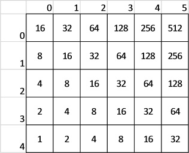
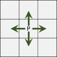
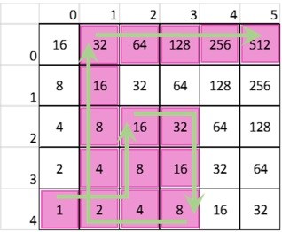

#### _Telerik Academy Season 2016-2017 / C# Advanced Exam - 31 May 2016_

# Task 3: Bit Shift Matrix

## Description

You are given rectangular matrix. The matrix is filled with numbers that are power of 2, as follows:
-	The bottom left corner holds the value 1
-	The next cell above holds value of 2, the next cell above holds of 4, etc…
-	The second cell the bottom row holds a value of 2, the cell next to it holds a value of 4

You have a pawn on the field. The pawn can only move to the cells that directly above, below it or right/left of it. We have four directions UP, DOWN, LEFT, RIGHT.

Given that initially the pawn starts at the bottom left corner and a list of cells that the pawn must reach calculate the sum of the cells that the pawn has to go through.
The value of each cell is calculated only once, i.e. if the pawn visits the same cell more than once, its value is added to the result only the first time (the value is collected).
**The top row is at position 0, the bottommost row is at position ROWS – 1.**
The pawn goes from one cell to the other, following the rules:
-	First go to the target column
-	Second go to the target row

## Example:

The pawn collects values: 1, 2, 4, 8, 16, 32, 16, 8, 4, 8, 16, 32, 64, 128, 256 and 512. Their sum is 1107.

## Input
- The input data is given at the standard input, i.e. the console
- On the first and the second lines you will find the **dimensions of the field R and C**
- On the third line you will find the number **N, the number of moves**
- On the fourth line you will find the **CODEs, decimal numbers** that represents the **positions from the path of the pawn**. They will be separated by a single space. The position is encoded as follows:
  -	A coefficient is calculated, **COEFF = MAX(R, C)**
  -	**ROW = CODE / COEF**
  -	**COL = CODE % COEF**
- The input will be valid, in the specified format, within the constraints given below. There is no need to check the input data explicitly.

## Output
-   Print the result of the operation with the provided numbers

## Constraints

-	R will always be between **1 and 100**
-	C will always be between **1 and 75**
-	N will always be between **1 and 1000**
- **Time limit: 0.1 s**
- **Memory limit: 16 MB**

## Sample tests

| **inout**                   | **output** |
|:----------------------------|:-----------|
| 5 6 4 14 27 1 5 | 1107       |

## Hints
1.	How are you going to fill the matrix? Is there any correlation between the column number and the starting value on the last row? Do you have the power?
2.	How are you going to keep track of which cells the pawn has already visited? Maybe a second array? 
3.	What is the rule when moving from one cell to another?
4.	Do you really need nested loops, besides for filling and printing the matrix?
5.	Try to separate the different components into different methods. In the ideal situation, the Main method should only execute other methods in a given order (describe the algorithm itself). This is not mandatory, but it’s preferable because it makes your code easily readable and decreases the chance of you getting confused. 

