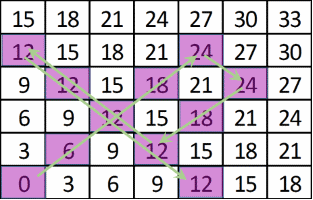
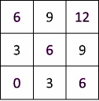

Problem 6 – Lover of 3
----------------------

Pesho is a lover of 3. He loves everything that is devisable by 3. He loves 3 so much, he created his own game with threes. Yet, Pesho is not a bright one, so he cannot calculate the result in his own game. The game is as follows:

The game has a rectangular field. The field is filled with numbers divisible by 3 as follows:

-   The bottom left corner holds the value 0
-   The next cell above holds value of 3, the next cell above holds of 6, etc…
-   The second cell the bottom row holds a value of 3, the cell next to it holds a value of 6

You have a pawn on the field. The pawn can only move to the cells that are diagonally next to it. The possible directions are UP-RIGHT, DOWN-RIGHT, UP-LEFT and DOWN-LEFT.

Given that initially the pawn starts at the bottom left corner, a list of directions and how many moves the pawn is about to perform in each direction, calculate the sum of the cells that the pawn has to go through.

The value of each cell is calculated only once, i.e. if the pawn visits the same cell more than once, its value is added to the result only the first time (the value is collected).

If the pawn is about to perform K moves in the given direction, but there are less than K cells before the edge of the field, the pawn performs as many moves as are available and stops at the edge of the field.

>**Example**:
 
>You are given a field with size 6x7, and the directions and moves:

>-   2 moves DOWN-RIGHT
>-   3 moves DOWN-LEFT
>-   6 moves UP-LEFT
>-   5 moves DOWN-RIGHT

>The pawn collects values: 0, 6, 12, 18, 24, 24, 18, 12, 12, 12 and 12. Their sum is 150.

Help Pesho in the calculation of the result!

### Input

The input data is given at the standard input, i.e. the console.  
On the first line you will find **the dimensions of the field** **R and C**, separated with a single space.  
On the second line you will find the number **N**, **the number of directions and moves**.  
On the next N lines you will find a **string D** and a **number K**, separated with a single space:  

-   D is the next direction of the pawn
-   K is the number of moves to perform in this direction

The input will be valid, in the specified format, within the constraints given below. There is no need to check the input data explicitly.

### Output

Print the sum of cells contained in the path of pawn.

### Constraints

-   **R** will always be between **1 and 1000**
-   **C** will always be between **1 and 750**
-   **N** will always be between **1 and 1000**
-   **K** will always be between **1 and 1000**
-   **D** will always have one of the values **RU**, **UR**, **LU**, **UL**, **DL**, **LD**, **RD** or **DR**:  
    -   RU and UR mean UP-RIGHT
    -   LU and UL mean UP-LEFT
    -   DL and LD mean DOWN-LEFT
    -   DR and RD mean DOWN-RIGHT
-   Allowed working time for your program: 0.15 seconds.
-   Allowed memory: 16 MB.

### Example

| **Input** | **Output** | **Explanation** |
|-----------|------------|-----------------|
|6 7 5 UR 5 RD 2 DL 3 LU 6 DR 5       | 150        | In the example  |

| **Input** | **Output** | **Explanation** |
|-----------|------------|-----------------|
|2 2 10 UR 2 LD 100 DR 500 UL 500 UL 5 LD 120 RD 123 LU 321 UR 2 LD 100	| 6          | The only values that can be collected are 0 and 6, and they are collected only once  |

| **Input** | **Output** | **Explanation** |
|-----------|------------|-----------------|
|3 3 4 UR 22 DL 2 DR 8 UL 75	| 30         |  -	Move UP-RIGHT, has only 3 moves and values 0, 6 and 12. All values are not yet collected, so the pawn collects them. -   Move DOWN-LEFT, has 2 moves and values 12 and 6. Both values are already collected, so the pawn collects nothing. -   Move DOWN-RIGHT, has only 2 moves and values 6 and 6. One of values is already collected, so the pawn collects only 6. -   Move UP-LEFT, has only 3 moves and values 6, 6 and 6. Two of the values are already collected, so the pawn collects only 6.  The sum is: 0 + 6 + 12 + 6 + 6 = 30 |
